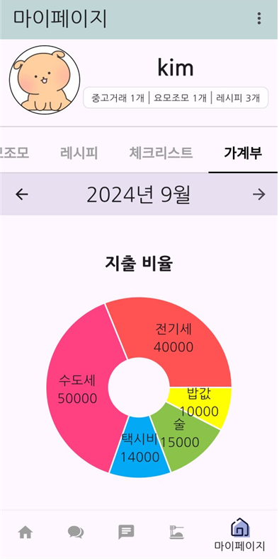

# 성결대학교 정보통신공학과 2024학년도 졸업작품

## 팀명 : 모자들(모여라 자취생들)
- 자취생들을 위한 다양한 서비스를 제공하는 앱

### 팀원 : 김지훈(FE), 박진형(BE), 김현수(App), 강재훈(Design)

### 사용 스택 : 
- **FrontEnd** : React, TypeScript, Axios, Zustand
- **BackEnd** : Java, Spring Boot
- **DB** : MySQL, Redis, Firebase
- **App** : Flutter
- **Design** : Figma, PPT

### 프로젝트 소개
#### 프로젝트 명 : HOWSE(House + How)
나날이 증가하는 1인가구를 위한 종합 커뮤니티 플랫폼 HOWSE 입니다.  
통계청 자료에 따르면 2017년 561만 가구에서 2022년 750만 가구로 1인가구의 수가 빠르게 증가하고 있으며, 이는 사회 구조의 변화와 생활 방식의 다양화를 반영합니다.  
그러나 1인가구를 위한 특화된 플랫폼은 부족한 상황이며, 이들이 가장 자주 이용하는 서비스는 개별적으로 운영되어 있어 분산된 정보로 인해 불편함을 초래하고 있습니다.  
이에 HOWSE는 1인가구가 자주 이용하는 주요 기능을 하나의 플랫폼으로 통합하려 합니다.  
개발 기간 : 약 6개월

#### HOWSE의 의미
HOWSE는 집과 주거 공간을 의미하는 "HOUSE"와 "어떻게?"를 의미하는 "HOW"를 결합하여 탄생한 서비스명입니다.  
이는 1인가구들이 더욱 합리적인 소비와 생활을 할 수 있도록 돕겠다는 목표를 담고 있습니다.

#### HOWSE에서 제공하는 기능
⭐ 중고거래  
⭐ 레시피 공유  
⭐ 요모조모(게시판)  
⭐ 가계부  
⭐ 자취생 확인 체크리스트  

### S/W Architecture
APP

### 동작 화면
#### 1. 요모조모(게시판)

- 커뮤니티 기능을 제공
- 좋아요, 댓글 달기 기능을 통한 소통
- 검색 기능을 통한 원하는 게시글 검색

#### 2. 중고거래

- 중고거래 기능을 제공
- 제품의 이미지, 가격, 설명, 거래희망장소 등을 입력
- 제품 상세페이지에서 좋아요, 댓글, 채팅 기능 제공
- 거래완료시 오른쪽 상단부에 빨간 글씨로 거래완료 표기 후 하단으로 내려감
- 원하는 물건 검색 가능
- firebase를 활용한 채팅기능을 통해 편리한 물건 거래
  
#### 3. 레시피 공유
   

- 일반 레시피와 편의점 레시피로 나누워 볼 수 있음
- 레시피 검색 가능
- 레시피 등록시 재료 설명과 각 요리단계에 맞는 이미지 추가
- 댓글과 좋아요 기능
  
#### 4. 마이페이지 - 체크리스트
   
  

- 집을 구할 때 확인할 사항들을 모아둬서 현명하게 방을 구할 수 있도록 체크리스트 제공

#### 5. 마이페이지 - 가계부
   
  

  

- 일별로 수익과 지출을 입력할 수 있음
- 한주마다 그주에 쓴 수익, 지출 금액을 한눈에 볼 수 있음
- 상세페이지에서 어떤 항목에 입 출근 내역 확인
- 파이차트를 통한 수익, 지출 비용 비율 확인
  
#### 6. 마이페이지 - 작성 게시글 모아보기
   
 

- 중고거래, 요모조모, 레시피 카테고리에서 쓴 글들을 각각 확인하고 직접 게시글로 이동 가능
